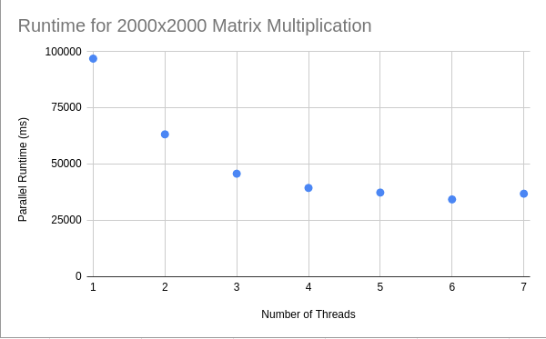
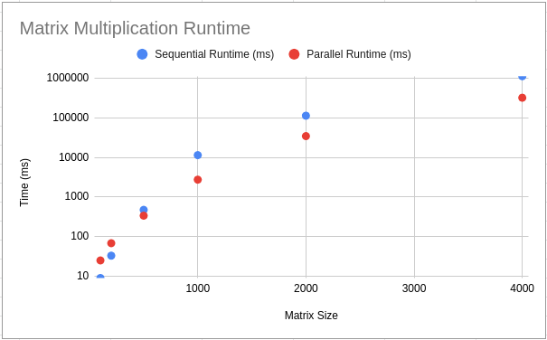

# ECSE 420 - Assignment 1

| Name         | ID        |
| ------------ | --------- |
| Paul Hooley  | 260727150 |
| Albert Kragl | 260732298 |

### Instructions for Running Code

All files can be run from the command line or in Eclipse. `Deadlock.java` and `MatrixMultiplication.java` can be run without any arguments, however `DiningPhilosophers.java` requires two arguments:

```
java DiningPhilosophers [numPhilosphers] [version]
```

The first argument specifies how many philosophers (threads) should be created, and the second argument specifies which version of the code to run (either `3.1`, `3.2` or `3.3`).

### 1.4.

<center><center/> 
### 1.5.

<center><center/> 

### 1.6.

For the chart in question 1.4., we see that the overall parallel runtime generally decreases as the number of threads increases, with a small increase in runtime from 6 to 7 threads. It seems that there is a "sweet spot" for the number of threads where the runtime is better compared to having less threads but also better or the same as having more. Possible reasons for this include the overhead of creating a large number of threads as well as the overhead of changing which threads are currently running. 

For the chart in question 1.5., when the matrix is of a smaller size the runtime of the sequential multiplication is faster than that of the parallel multiplication. This is likely due to the overhead of having to create all the threads and manage them (note that the optimum thread count that we found was 6). However this problem quickly disappears when the size of the matrices increases. For the matrix multiplication above $1000\times 1000$ the runtime for the sequential multiplication was noticeably larger than the parallel version.

### 2.1.

There are 4 conditions that could cause a deadlock. First is mutual exclusion, where a process requires exclusive control of its resources. Second is the concept of hold and wait, where the process must hold its resources while waiting to get others. Third is no preemption, where much like hold and wait the process will not give up its resources until it is finished with them. Lastly, circular wait must be present so that each process/thread in a chain holds the resources that the next one requires.

### 2.2

There are a few common strategies to deal with deadlock. Since all 4 of the above conditions must be true for a deadlock to occur, all we have to do is ensure one of them is prevented. Firstly, we could disallow mutual exclusion. Secondly we could stop the hold and wait by blocking the process until all resources it requires are available. We can add preemption by forcing a process to release all resources that it is holding if it cannot get all that it needs, and then request them again at a later time. Lastly we can prevent circular wait by defining a linear ordering of resource types.

### 3.2.

To avoid deadlock, we need to prevent one of the four necessary conditions that can allow deadlock to occur. In our approach, we disallow the circular wait condition by having one of the philosophers pick up the right chopstick first instead of the left one. In our implementation we made the first philosopherpick up their chopsticks in reverse order. This avoids the situation where each philosopher picks up the chopstick to their left, causing deadlock.

The code snippet below shows the relevant part of our implementation (taken from Appendix C):

```java
for (int i = 0; i < numberOfPhilosophers; i++) {
	Object leftChopstick = chopsticks[i];
	Object rightChopstick = chopsticks[(i + 1) % numberOfPhilosophers];

	if (i == 0) {
		// first philosopher picks up right chopstick first to break 
		// circular wait condition and avoid deadlock
		philosophers[i] = new Philosopher(rightChopstick, leftChopstick);
	} else {
		philosophers[i] = new Philosopher(leftChopstick, rightChopstick);
	}
				
	Thread t = new Thread(philosophers[i], "Philosopher " + (i + 1));
	t.start();
}
```

This gives an output similar to the following:

```
$ java DiningPhilosophers 5 3.2
Philosopher 3: Thinking
Philosopher 2: Thinking
Philosopher 5: Thinking
Philosopher 4: Thinking
Philosopher 1: Thinking
Philosopher 3: Picked up left chopstick
Philosopher 2: Picked up left chopstick
Philosopher 4: Picked up left chopstick
Philosopher 5: Picked up left chopstick
Philosopher 5: Picked up right chopstick, eating...
Philosopher 5: Put down right chopstick
Philosopher 5: Put down left chopstick, thinking...
Philosopher 5: Thinking
...
```

### 3.3.

To avoid starvation, we modified our implementation from part 3.2 to use Semaphores instead of Objects for the chopsticks. One of the constructors for the Java `Semaphore` class accepts a `fair` boolean argument, which specifies if the Semaphore will guarantee FIFO granting of permits under contention (yes if the argument is `true`). This way, each chopstick is granted in a fair way and the philosopher that has waited longest will be granted the chopstick, preventing starvation. The output looks very similar to that of section 3.2.

The code snippets below shows the relevant parts of our implementation (taken from Appendix C):

```java
for (int i = 0; i < numberOfPhilosophers; i++) {
	Semaphore leftChopstick = chopsticks[i];
	Semaphore rightChopstick = chopsticks[(i + 1) % numberOfPhilosophers];

	if (i == 0) {
		// first philosopher picks up right chopstick first to break 
		// circular wait condition and avoid deadlock
		philosophers[i] = new PhilosopherSemaphore(rightChopstick, leftChopstick);
	} else {
		philosophers[i] = new PhilosopherSemaphore(leftChopstick, rightChopstick);
	}
				
	Thread t = new Thread(philosophers[i], "Philosopher " + (i + 1));
	t.start();
}
```

```java
/**
 * Modified Philosopher class for question 3.3.
 */
public static class PhilosopherSemaphore implements Runnable {

	private Semaphore leftChopstick;
	private Semaphore rightChopstick;

	public PhilosopherSemaphore(Semaphore leftChopstick, Semaphore rightChopstick) {
		this.leftChopstick = leftChopstick;
		this.rightChopstick = rightChopstick;
	}

	@Override
	public void run() {
		try {
			while (true) {
				System.out.println(Thread.currentThread().getName() + ": Thinking");

				leftChopstick.acquire();
				System.out.println(Thread.currentThread().getName() + ": Picked up left chopstick");

				rightChopstick.acquire();
				System.out.println(Thread.currentThread().getName() + ": Picked up right chopstick, eating..."); 
				Thread.sleep(((int) (Math.random() * 200)));

				rightChopstick.release();
				System.out.println(Thread.currentThread().getName() + ": Put down right chopstick");

				leftChopstick.release();
				System.out.println(Thread.currentThread().getName() + ": Put down left chopstick, thinking...");
			}
		} catch (InterruptedException e) {
			Thread.currentThread().interrupt();
			return;
		}
	}
}
```

### 4.1.

Given that the sequential part of the program accounts for 30% of the execution time, we know that $p = 0.7$. We can use the following equation to determine a limit for the overall speedup:

$speedup \leq \frac{1}{1 - p} = \frac{1}{1 - 0.7} = 3.33$

Therefore the best possible speedup would be to make the program run 3.33 times faster.

### 4.2.

We can express this problem as follows:
$$
\frac{1}{\frac{0.4}{k} + \frac{0.6}{n}} > 2\times \frac{1}{0.4 + \frac{0.6}{n}}
$$

Then we can solve for $k$:
$$
\frac{1}{\frac{0.4}{k} + \frac{0.6}{n}} > 2 \times \frac{1}{0.4 + \frac{0.6}{n}} \\
2(\frac{0.4}{k} + \frac{0.6}{n}) < 0.4 + \frac{0.6}{n} \\
\frac{0.8}{k} + \frac{1.2}{n} < 0.4 + \frac{0.6}{n} \\
\frac{0.6}{n} - 0.4 < -\frac{0.8}{k} \\
-\frac{0.6}{n} + 0.4 > \frac{0.8}{k} \\
0.4 - \frac{0.6}{n} > \frac{0.8}{k} \\
k(0.4 - \frac{0.6}{n}) > 0.8 \\
k > \frac{0.8}{0.4 - \frac{0.6}{n}} \\
k > 2 - \frac{4}{3}n, \; n > 1
$$

### 4.3.

> Note: for this problem we are assuming that "Suppose the sequential time percentage could be decreased four times" means the sequential time percentage could be decreased by a factor of four (i.e. divided by four).

We can express the problem as follows:
$$
\frac{1}{\frac{1-p}{4} + \frac{p}{n}} = 2 \times \frac{1}{1-p + \frac{p}{n}}
$$

We can then solve for $p$:
$$
\frac{1}{2(\frac{1-p}{4} + \frac{p}{n})} = \frac{1}{1-p+\frac{p}{n}} \\
2(\frac{1-p}{4} + \frac{p}{n}) = 1-p+\frac{p}{n} \\ 
\frac{1-p}{2} + \frac{2p}{n} = 1-p+\frac{p}{n} \\ 
\frac{1-p}{2} = \frac{p}{n} \\
\frac{2}{n} = \frac{1-p}{p} = \frac{1}{p} - 1 \\
\frac{1}{p} = \frac{2}{n} + 1 \\
p = \frac{n}{n+2}
$$

Lastly we can find the overall execution time of the sequential part by finding an expression for $1 - p$:
$$
p = \frac{n}{n+2} \\
1 - p = 1 - \frac{n}{n+2}
$$

### Appendix A

`MatrixMultiplication.java`

```java
import java.util.concurrent.ExecutorService;
import java.util.concurrent.Executors;

public class MatrixMultiplication {
	
	private static final int NUMBER_THREADS = 6;
	private static final int MATRIX_SIZE = 4000;

    public static void main(String[] args) {
		// Generate two random matrices, same size
		double[][] a = generateRandomMatrix(MATRIX_SIZE, MATRIX_SIZE);
		double[][] b = generateRandomMatrix(MATRIX_SIZE, MATRIX_SIZE);
		long startTime = System.currentTimeMillis();
		sequentialMultiplyMatrix(a, b);
		long runTime = System.currentTimeMillis()- startTime;
		System.out.println(MATRIX_SIZE + " by " + MATRIX_SIZE + " Sequential runtime: " + runTime);
		long parStartTime = System.currentTimeMillis();
		parallelMultiplyMatrix(a, b);	
		long parRunTime = System.currentTimeMillis() - parStartTime;
		System.out.println(NUMBER_THREADS+ " threads Parallel runtime: " + parRunTime);
	}
	
	/**
	 * Returns the result of a sequential matrix multiplication
	 * The two matrices are randomly generated
	 * @param a is the first matrix
	 * @param b is the second matrix
	 * @return the result of the multiplication
	 * */
	public static double[][] sequentialMultiplyMatrix(double[][] a, double[][] b) {
		double[][] out = new double[a.length][a[0].length];
		for(int i = 0; i < a.length; i++) {
			for(int j = 0; j < a[0].length; j++) {
				for(int k = 0; k < a[0].length; k++) {
					out[i][j] += a[i][k] * b[k][j];
				}
			}
		}
		return out;
	}
	
	/**
	 * Returns the result of a concurrent matrix multiplication
	 * The two matrices are randomly generated
	 * @param a is the first matrix
	 * @param b is the second matrix
	 * @return the result of the multiplication
	 * */
    public static double[][] parallelMultiplyMatrix(double[][] a, double[][] b) {
		double[][] out = new double[a.length][a[0].length];
		try {
			ExecutorService ex = Executors.newFixedThreadPool(NUMBER_THREADS);

			for(int i = 0; i < a.length; i++) {
				for(int j = 0; j < a[0].length; j++) {
					ex.execute(new multiply(i,j,a,b,out));
				}
			}
			ex.shutdown();
			while(!ex.isTerminated()) {}

		} catch (Exception e) {
			e.printStackTrace();
		}
		return out;
	}

	static class multiply implements Runnable {

		private int i;
		private int j;
		private double[][] a;
		private double[][] b;
		private double[][] out;
	
		multiply(final int i, final int j, final double[][] a, final double[][] b, final double[][] out) {
		  this.i = i;
		  this.j = j;
		  this.a = a;
		  this.b = b;
		  this.out = out;
		}
	
		public void run() {
			for (int k = 0; k < a[0].length; k++) {
				out[i][j] += a[i][k] * b[k][j];
		  	}
		}
	}

	/**
	 * Populates a matrix of given size with randomly generated integers between 0-10.
	 * @param numRows number of rows
	 * @param numCols number of cols
	 * @return matrix
	 */
    private static double[][] generateRandomMatrix (int numRows, int numCols) {
        double matrix[][] = new double[numRows][numCols];
        for (int row = 0 ; row < numRows ; row++ ) {
            for (int col = 0 ; col < numCols ; col++ ) {
                matrix[row][col] = (double) ((int) (Math.random() * 10.0));
            }
        }
        return matrix;
    }
	
}
```

### Appendix B

`Deadlock.java`

```java
public class Deadlock {
    public static void main(String[] args) {
        Object resource1 = new Object();
        Object resource2 = new Object();

        Thread t1 = new Thread("Thread 1") {
            public void run() {
                try {
                    synchronized (resource1) {
                        System.out.println(Thread.currentThread().getName() + " Has Resource 1");
                        sleep(1000);
                        synchronized (resource2) { 
                            System.out.println(Thread.currentThread().getName() + " Has Resource 2");
                        }
                    }
                } catch(Exception e) {
                    e.printStackTrace();
                    System.exit(0);
                }
            }       
        };     

        Thread t2 = new Thread("Thread 2") {
            public void run() {
                try {
                    synchronized (resource2) {
                        System.out.println(Thread.currentThread().getName() + " Has Resource 2");
                        sleep(1000);
                        synchronized (resource1) {
                            System.out.println(Thread.currentThread().getName() + " Has Resource 1");
                        }
                    }
                } catch(Exception e) {
                    e.printStackTrace();
                    System.exit(0);
                }
            }       
        };
        // The two threads have hold and wait over exclusive resources. No preemption is employed so they never give up their respective resources. 
        t1.start();
        t2.start();
    }
}
```

### Appendix C

`DiningPhilosophers.java`

```java
import java.util.concurrent.Semaphore;

public class DiningPhilosophers {
	
	/**
	 * The implementation for questions 3.1 and 3.2 was based on 
	 * https://www.baeldung.com/java-dining-philoshophers.
	 */
	public static void main(String[] args) {
		if (args.length != 2) {
			System.out.println("Error: invalid arguments");
			System.out.println("Usage: java DiningPhilosophers [numPhilosophers] [3.1 | 3.2 | 3.3]");
			return;
		}
		int numberOfPhilosophers = Integer.parseInt(args[0]);
		String version = args[1];

		if (version.equals("3.1")) {
			Philosopher[] philosophers = new Philosopher[numberOfPhilosophers];
			Object[] chopsticks = new Object[numberOfPhilosophers];

			for (int i = 0; i < chopsticks.length; i++) {
				chopsticks[i] = new Object();
			}

			for (int i = 0; i < numberOfPhilosophers; i++) {
				Object leftChopstick = chopsticks[i];
				Object rightChopstick = chopsticks[(i + 1) % numberOfPhilosophers];

				philosophers[i] = new Philosopher(leftChopstick, rightChopstick);
				
				Thread t = new Thread(philosophers[i], "Philosopher " + (i + 1));
				t.start();
			}
		} else if (version.equals("3.2")) {
			Philosopher[] philosophers = new Philosopher[numberOfPhilosophers];
			Object[] chopsticks = new Object[numberOfPhilosophers];

			for (int i = 0; i < chopsticks.length; i++) {
				chopsticks[i] = new Object();
			}

			for (int i = 0; i < numberOfPhilosophers; i++) {
				Object leftChopstick = chopsticks[i];
				Object rightChopstick = chopsticks[(i + 1) % numberOfPhilosophers];

				if (i == 0) {
					// first philosopher picks up right chopstick first to break 
					// circular wait condition and avoid deadlock
					philosophers[i] = new Philosopher(rightChopstick, leftChopstick);
				} else {
					philosophers[i] = new Philosopher(leftChopstick, rightChopstick);
				}
				
				Thread t = new Thread(philosophers[i], "Philosopher " + (i + 1));
				t.start();
			}
		} else if (version.equals("3.3")) {
			PhilosopherSemaphore[] philosophers = new PhilosopherSemaphore[numberOfPhilosophers];
			Semaphore[] chopsticks = new Semaphore[numberOfPhilosophers];

			for (int i = 0; i < chopsticks.length; i++) {
				// set second argument to true to enable fairness queueing
				chopsticks[i] = new Semaphore(1, true);
			}

			for (int i = 0; i < numberOfPhilosophers; i++) {
				Semaphore leftChopstick = chopsticks[i];
				Semaphore rightChopstick = chopsticks[(i + 1) % numberOfPhilosophers];

				if (i == 0) {
					// first philosopher picks up right chopstick first to break 
					// circular wait condition and avoid deadlock
					philosophers[i] = new PhilosopherSemaphore(rightChopstick, leftChopstick);
				} else {
					philosophers[i] = new PhilosopherSemaphore(leftChopstick, rightChopstick);
				}
				
				Thread t = new Thread(philosophers[i], "Philosopher " + (i + 1));
				t.start();
			}
		} else {
			System.out.println("Error: invalid program version specified");
			System.out.println("Usage: java DiningPhilosophers [numPhilosophers] [3.1 | 3.2 | 3.3]");
		}
	}

	public static class Philosopher implements Runnable {

		private Object leftChopstick;
		private Object rightChopstick;

		public Philosopher(Object leftChopstick, Object rightChopstick) {
			this.leftChopstick = leftChopstick;
			this.rightChopstick = rightChopstick;
		}

		@Override
		public void run() {
			try {
				while (true) {
					System.out.println(Thread.currentThread().getName() + ": Thinking");
					synchronized (leftChopstick) {
						System.out.println(Thread.currentThread().getName() + ": Picked up left chopstick");
						Thread.sleep(((int) (Math.random() * 200)));
						synchronized (rightChopstick) {
							System.out.println(Thread.currentThread().getName() + ": Picked up right chopstick, eating..."); 
							Thread.sleep(((int) (Math.random() * 200)));
							System.out.println(Thread.currentThread().getName() + ": Put down right chopstick");
						}
						
						System.out.println(Thread.currentThread().getName() + ": Put down left chopstick, thinking...");
					}
				}
			} catch (InterruptedException e) {
				Thread.currentThread().interrupt();
				return;
			}
		}
	}

	/**
	 * Modified Philosopher class for question 3.3.
	 */
	public static class PhilosopherSemaphore implements Runnable {

		private Semaphore leftChopstick;
		private Semaphore rightChopstick;

		public PhilosopherSemaphore(Semaphore leftChopstick, Semaphore rightChopstick) {
			this.leftChopstick = leftChopstick;
			this.rightChopstick = rightChopstick;
		}

		@Override
		public void run() {
			try {
				while (true) {
					System.out.println(Thread.currentThread().getName() + ": Thinking");

					leftChopstick.acquire();
					System.out.println(Thread.currentThread().getName() + ": Picked up left chopstick");

					rightChopstick.acquire();
					System.out.println(Thread.currentThread().getName() + ": Picked up right chopstick, eating..."); 
					Thread.sleep(((int) (Math.random() * 200)));

					rightChopstick.release();
					System.out.println(Thread.currentThread().getName() + ": Put down right chopstick");

					leftChopstick.release();
					System.out.println(Thread.currentThread().getName() + ": Put down left chopstick, thinking...");
				}
			} catch (InterruptedException e) {
				Thread.currentThread().interrupt();
				return;
			}
		}
	}

}

```

